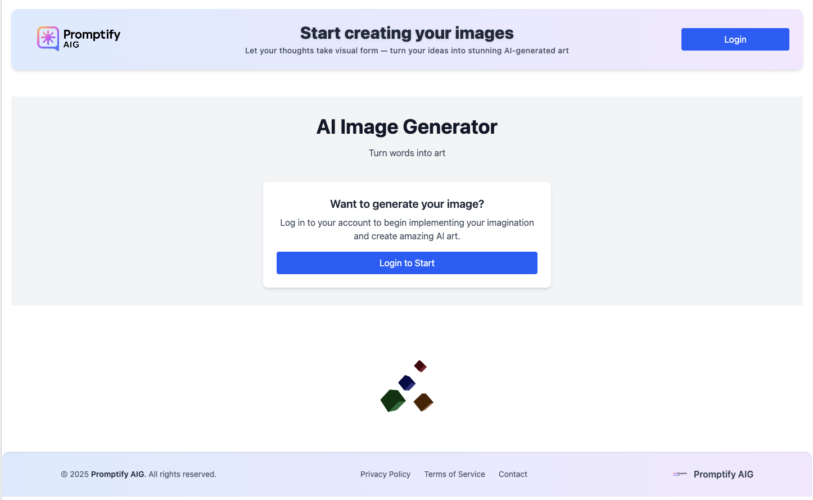
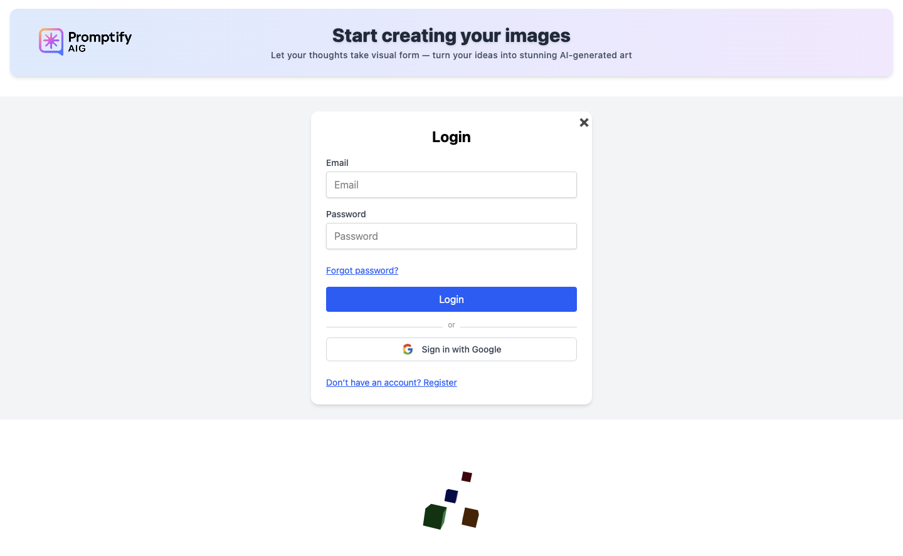
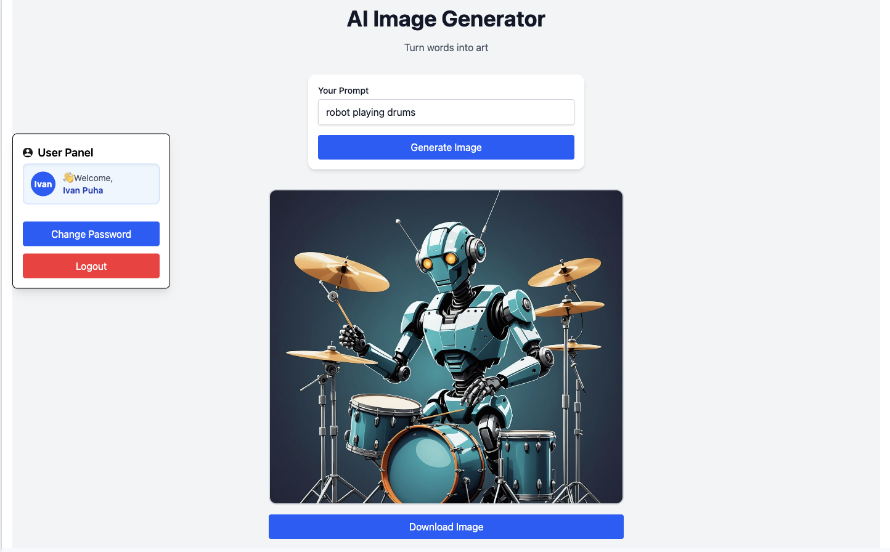
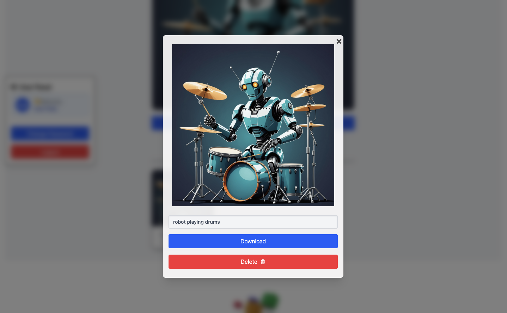
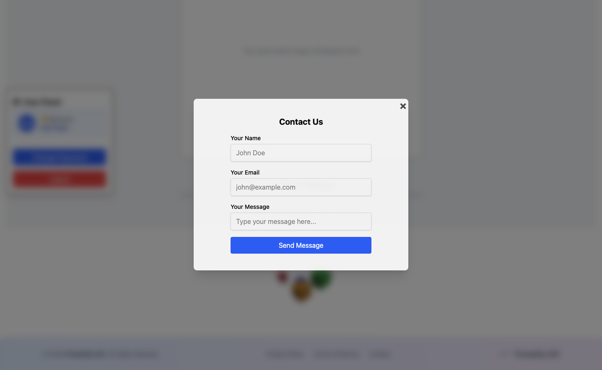
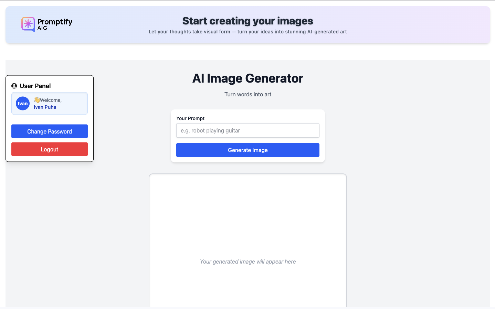

# Promtify AIG – AI Image Generator

Promtify AIG is a full-stack AI image generation platform where users can:

- Generate unique AI images from text prompts
- View their personal image history
- Delete images stored on the cloud
- Register/login using email & password or Google OAuth
- Reset and change their password securely
- Contact support directly via the built-in contact form
- View Privacy Policy and Terms of Service pages

This project was built as a **portfolio project** to demonstrate **full-stack development skills**, **authentication flows**, **AWS S3 integration**, and **AI API usage**.

---

## 🚀 Live Demo

**[https://promtify-aig.com](https://promtify-aig.com)**

---

## 📸 Screenshots

### 1. Home Page

### 2. Login & Registration

### 3. Dashboard – Image Generation

### 4. Image History & Deletion

### 5. Contact Modal

### 5. User Panel

---

## 📸 Features

- **AI Image Generation**
  - Uses **Stability AI** API to generate images from text prompts
  - Handles **unsafe prompt filtering** gracefully

- **User Authentication**
  - Email & Password authentication with **JWT cookies**
  - **Google OAuth 2.0** support
  - Password reset & email verification flows

- **User Dashboard**
  - View personal **image history** (stored in MongoDB)
  - Delete images securely with S3 cleanup
  - Fully **responsive design** with mobile-first UI

- **Contact Form**
  - Built-in modal form to contact support
  - Toast notifications for success/failure

- **Legal Pages**
  - Privacy Policy & Terms of Service with modern UI
  - Linked in footer and accessible via SPA navigation

- **Security & UX**
  - Cookies are `httpOnly`, `SameSite=None` for secure cross-domain auth
  - Validation for all forms and prompts
  - Clean error handling with friendly messages

---

## 🛠️ Tech Stack

**Frontend:**

- React 18 + Vite
- TailwindCSS
- React Router DOM
- React Toastify (notifications)

**Backend:**

- Node.js + Express
- MongoDB + Mongoose
- Passport.js (Google OAuth)
- JWT Auth (Cookie-based)
- AWS S3 (Image Storage)
- Stability AI API (Image Generation)

**Deployment & Hosting:**

- Frontend: Vercel / Netlify _(or your chosen host)_
- Backend: VPS / Render / Railway _(depending on your setup)_
- Database: MongoDB Atlas
- Storage: AWS S3

---

✅ Future Improvements
Payment integration for image credits

Gallery page with AI prompt inspiration

Social sharing of generated images

Email sending via SendGrid/Postmark for reliable delivery

---

📄 License
This project is licensed under the MIT License.

---

## 🙋 About the Author

**Ivan Puha**  
Full-Stack Developer | React, Node.js

[LinkedIn](https://www.linkedin.com/in/ivan-puga/)
